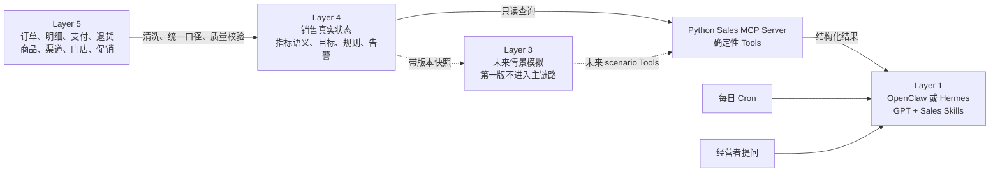
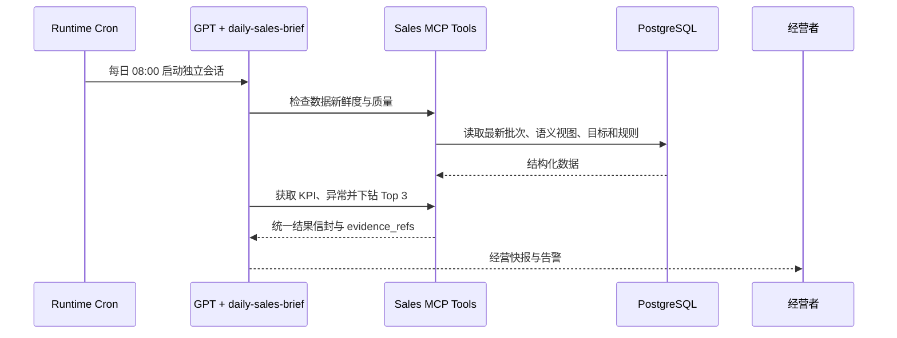
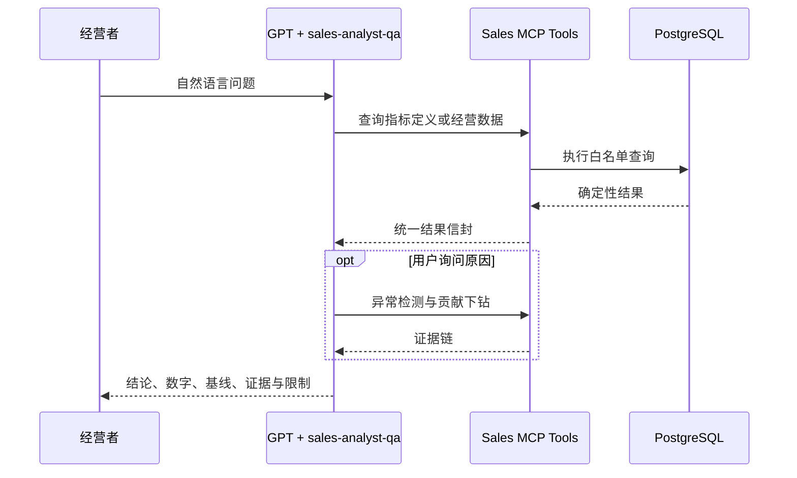

# 全渠道零售企业销售监控与诊断 Agent 模块设计

日期：2026-09-10  
状态：待小组审核  
项目周期：4 人 × 3 周  
销售模块负责人工作量：1 人 × 3 周  
第一阶段数据规模：10,000 笔订单

## 1. 设计结论

销售模块采用以下精简路线：

- 使用 OpenClaw 或 Hermes 作为现成 Agent Runtime；
- 使用成熟 GPT 模型完成自然语言理解、Tool 选择、分析编排和解释；
- 不训练、不微调模型，也不自行开发基础 Agent 框架；
- 第一版不使用 LangGraph，避免与现成 Runtime 的编排能力重复；
- 销售指标、异常检测和贡献度计算全部由确定性 Python/SQL Tools 完成；
- Sales Tools 暴露为独立 MCP Server，不依赖特定 Runtime；
- 第一版范围为“监控 + 诊断”，不实现完整情景模拟；
- 同时支持每日主动快报、异常告警和经营者按需追问；
- 同时使用历史滚动基线和企业经营目标判断异常。

核心原则是：**GPT 负责理解与解释，Tools 负责计算，PostgreSQL 负责保存企业事实与运营状态。**

## 2. 目标与非目标

### 2.1 第一阶段目标

销售 Agent 应能够：

1. 计算日、周、月销售表现；
2. 比较前期、滚动历史基线和经营目标；
3. 自动发现需要经营者关注的异常；
4. 按渠道、门店、品类和商品逐层定位主要贡献项；
5. 识别退货、支付差异、取消和延迟交付等伴随风险；
6. 每日自动形成经营快报并支持临时追问；
7. 为数字和结论提供可追溯的数据证据；
8. 明确区分真实源数据、派生数据和合成经营假设。

### 2.2 第一阶段不做

- 不训练或微调大语言模型；
- 不开发销售预测、自动定价或自动促销模型；
- 不自动修改真实订单、目标或其他 Actual State；
- 不让 Agent 直接执行任意 SQL；
- 不开发独立聊天前端，优先使用 Runtime 自带界面或消息渠道；
- 不建设客户画像、库存余额、采购和会计凭证；
- 不实现完整 Layer 3 情景模拟，只预留接口边界。

## 3. 与小组五层架构的对应关系



监控和诊断直接查询 Layer 4 的 Actual State，不绕经模拟层。未来 Layer 3 只能复制带版本的状态快照，在副本中运行价格、促销或渠道情景，不能改写 Layer 4。

## 4. 技术架构

### 4.1 Agent 与模型层

- Agent Runtime：OpenClaw 或 Hermes，由全组统一选择；
- LLM：通过 Runtime 配置成熟 GPT 模型；
- 模型职责：识别意图、补充必要参数、选择 Tool、组织诊断步骤、生成解释；
- 模型不得自行计算经营数字，也不得把训练知识当成企业事实；
- 第一版不使用向量数据库。指标定义、字段血缘和数据状态通过 Tool 查询。

参考官方能力说明：

- OpenClaw：[OpenAI provider](https://docs.openclaw.ai/openai)、[Cron](https://docs.openclaw.ai/cron)、[Tools/Skills/Plugins](https://github.com/openclaw/openclaw/blob/main/docs/tools/index.md)；
- Hermes：[Skills](https://github.com/NousResearch/hermes-agent/blob/main/website/docs/developer-guide/creating-skills.md)、[Cron](https://github.com/NousResearch/hermes-agent/blob/main/website/docs/user-guide/features/cron.md)、[原生 MCP](https://github.com/NousResearch/hermes-agent/blob/main/skills/autonomous-ai-agents/hermes-agent/references/native-mcp.md)。

### 4.2 Sales MCP 层

Sales MCP 使用 Python 实现，通过稳定 JSON Schema 暴露 Tools。内部使用 Pydantic 校验参数，并通过 psycopg 或 SQLAlchemy 查询 PostgreSQL。

MCP Server 不依赖 OpenClaw 或 Hermes 内部 API。第 1 周用 MCP Inspector 或测试客户端验收，第 2 周再接入全组选定的 Runtime。

### 4.3 权限边界

- Agent 无权直接连接数据库，只能调用白名单 Sales Tools；
- Tools 只接受枚举指标、允许维度、明确时间范围和受限 Top N；
- 不暴露 `run_sql` 或任意查询工具；
- 交易事实仅 ETL 账号可写；
- 目标和规则由管理员或种子脚本维护；
- 监控服务只能写告警、运行日志和 Tool 审计；
- 每次 Tool 调用记录 `query_id`、参数哈希、耗时、结果行数和错误状态。

## 5. 现有销售数据

第一阶段已有：

| 数据表 | 粒度 | 行数 |
| --- | --- | ---: |
| `sales_orders` | 每笔订单 | 10,000 |
| `sales_order_lines` | 每个订单—商品明细 | 10,285 |
| `sales_payments` | 每次支付事件 | 10,527 |
| `sales_returns` | 每次退货事件 | 289 |
| `sales_promotions` | 每个促销定义 | 6 |
| `sales_order_promotions` | 每个促销订单明细 | 1,543 |
| `products` | 每个商品 | 6,154 |
| `stores` | 每家实体门店 | 4 |
| `channels` | 每个销售渠道 | 3 |

订单、商品、价格、支付、状态和时间间隔主要基于 Olist 公开数据。渠道、门店、促销、退货和 2025 年业务时间属于确定性合成或派生字段。Agent 必须通过字段血缘区分两者。

## 6. PostgreSQL 增量模型

### 6.1 `sales`：真实状态

- 保留现有订单、明细、支付、退货及维表；
- 新增 `data_load_runs`，记录批次、数据截止时间、行数、质量状态、源版本和完成时间；
- Agent 只读，ETL 可写。

### 6.2 `sales_analytics`：确定性语义

- `metric_catalog`：指标代码、定义、SQL 口径、状态过滤、单位、允许维度、血缘和版本；
- `mv_sales_daily_cube`：按日期、渠道、门店、品类和是否促销进行日级聚合；
- `v_sales_reconciliation`：支付差异、退款、取消、不可用和交付状态；
- `v_sales_baselines`：前期值、滚动 4 周中位数、稳健偏差和最小样本量。

### 6.3 `sales_ops`：企业运营模型

#### `sales_targets`

包含期间、指标、维度类型、维度值、目标值、来源类型和版本。第一阶段支持 `company`、`channel`、`store` 和 `category` 四种维度。

目标可依据历史月度分布生成，再加入有限、可解释的增长或收缩假设。`source_type` 固定标记为 `synthetic_plan`，不能表述为真实预算。

#### `alert_rules`

保存指标、维度、警告阈值、严重阈值、最小订单数、规则版本和启用状态。建议初始值：

- 目标缺口 10%：警告；目标缺口 20%：严重；
- 历史稳健偏差绝对值 2.5：警告；3.5：严重；
- 分组少于 30 笔订单：不评级，只返回低样本提示。

所有阈值均可配置，不写死在 Skill 中。

#### 其他运营表

- `alert_events`：Actual、目标、历史基线、差异、严重度、贡献项、证据、规则版本和处理状态；
- `agent_runs`：触发方式、起止时间、数据截止时间、状态、报告位置和错误码；
- `tool_audit`：Tool、参数哈希、`query_id`、耗时、结果行数和错误。

告警以“日期 + 指标 + 维度 + 规则版本”生成唯一指纹，重复定时运行不得产生重复告警。

## 7. 第一阶段 KPI

### 7.1 规模与效率

| 指标 | 定义 |
| --- | --- |
| `booked_merchandise_amount` | 排除 `canceled` 和 `unavailable` 后的商品成交额 |
| `fulfilled_merchandise_amount` | `delivered` 订单的商品成交额 |
| `net_fulfilled_sales` | 已交付商品成交额减退款金额 |
| `valid_order_count` | 排除 `canceled` 和 `unavailable` 的订单数 |
| `average_order_value` | 有效订单 `order_total_amount` ÷ 有效订单数 |
| `units_sold` | 有效订单的 `quantity` 合计 |
| `units_per_order` | 有效销量 ÷ 有效订单数 |

报告中的“销售额”必须注明口径，不得混用商品成交额、含运费订单额、支付额和扣退款净销售额。

### 7.2 目标、趋势和健康度

- 前一等长期间变化；
- 滚动 4 周历史基线偏差；
- 目标完成率和目标缺口；
- 当月 run-rate 期末完成度，不称为机器学习预测；
- 促销销售占比、合成折扣率、退货订单率和退款金额；
- 取消率、不可用订单率和延迟交付率；
- 支付差异订单数、绝对金额与净额；
- 数据批次新鲜度和质量状态。

促销和退货数据包含合成字段，解释时必须标示限制。

## 8. 双基线异常与下钻

```text
质量门禁
  → 与经营目标比较
  → 与前期及滚动 4 周历史比较
  → 合并异常等级
  → 按维度计算贡献项
  → 输出证据和限制
```

规则：

1. 目标与历史同时异常时优先级最高；
2. 任一基线达到严重阈值即生成严重告警；
3. 双基线冲突时同时展示，例如“较历史改善，但仍未达目标”；
4. 低样本不评级；数据质量失败或过期时停止经营判断；
5. 下钻只能称为“主要贡献项”或“伴随变化”，不得直接表述为因果原因。

下钻顺序：企业整体 → 渠道 → 门店或品类 → 商品 Top N。

## 9. 七个 Sales MCP Tools

| Tool | 主要输入 | 输出 |
| --- | --- | --- |
| `get_sales_overview` | 时间、粒度、筛选 | KPI、目标、前期、滚动基线、质量状态 |
| `compare_sales_periods` | 指标、两个期间、筛选 | 两期数值、绝对变化、百分比、样本量 |
| `detect_sales_anomalies` | 时间、指标、维度、最低严重度 | 双基线偏差、严重度、规则版本、指纹 |
| `decompose_metric_change` | 指标、两期、维度、Top N | 分组变化额、贡献率、样本量、证据 |
| `get_sales_slice` | 白名单指标、维度、时间、排序、上限 | 受控聚合结果，不接受 SQL |
| `get_reconciliation_summary` | 时间和可选筛选 | 支付差异、退款、取消和交付健康度 |
| `get_metric_definition` | 指标代码 | 定义、公式、状态过滤、单位、维度和血缘 |

所有 Tools 返回统一信封：

```json
{
  "as_of": "2025-12-31T23:59:59Z",
  "period": {"start": "2025-12-01", "end": "2025-12-31"},
  "filters": {},
  "metric_code": "net_fulfilled_sales",
  "value": 0,
  "comparison": {},
  "target": {},
  "severity": "none",
  "contributors": [],
  "evidence_refs": [],
  "lineage": {},
  "warnings": [],
  "query_id": "uuid"
}
```

空数据、除零、未知指标、无目标、低样本和数据过期必须明确返回，不能默认为零。

## 10. 三个 Sales Skills

### `daily-sales-brief`

检查数据 → 读取昨日、近 7 日和当月 KPI → 比较双基线 → 选择最多 3 个异常 → 贡献下钻 → 查询伴随风险 → 形成带证据的每日快报。

### `sales-anomaly-triage`

验证异常与样本量 → 检查双基线 → 按渠道、门店、品类和商品下钻 → 检查退货、支付、取消、促销和交付 → 输出贡献项、证据、限制和验证方向。

### `sales-analyst-qa`

提取指标、时间、维度、筛选和比较意图 → 必要时只追问一个关键问题 → 查询指标定义 → 调用最少数量的 Tools → 用户问“为什么”时才进入诊断 → 返回结论、数字、基线、证据和限制。

Skills 只包含流程、边界和表达规则，不包含 SQL、指标公式或硬编码阈值。

## 11. 主动与按需流程

### 11.1 每日主动流程



### 11.2 按需追问流程



统一报告结构：执行摘要 → KPI 与双基线 → 异常 Top 3 → 贡献项 → 支付/退货风险 → 数据证据与限制 → 建议追问。

## 12. 失败与降级

| 情况 | 行为 |
| --- | --- |
| 数据过期或质量失败 | 停止经营判断，发送数据健康告警 |
| 目标缺失 | 使用历史基线，标明无法判断目标完成度 |
| 样本量不足 | 返回观察值和警告，不评级 |
| Tool 超时或失败 | 最多重试一次；仍失败则记录并透明说明 |
| 双基线冲突 | 同时呈现两种事实，不强行合并 |
| 无法证明因果 | 报告贡献与伴随变化，建议补充其他领域证据 |
| 问题缺少关键参数 | 只追问一个会实质影响答案的问题 |
| 用户要求写 Actual State | 拒绝并说明销售 Agent 为只读分析角色 |

## 13. 测试与评估

### 13.1 确定性测试

- 指标 SQL 与源订单抽样重算一致；
- 状态过滤、空值、除零、退款和支付差异边界正确；
- 日聚合与事实表可对账；
- 目标和告警指纹唯一，重复运行不重复告警；
- 每个 Tool 覆盖正常、空数据、非法参数和数据库错误路径；
- JSON Schema、白名单维度、Top N 和时间范围限制有效；
- 10,000 笔订单下，常用数据库查询目标低于 3 秒。

异常测试夹具至少覆盖销售下降、渠道未达目标、品类贡献下降、退货上升、支付差异增加、低样本和双基线冲突。

### 13.2 Agent Skill 评估

建立至少 25 个固定问题：12 个事实查询、8 个异常诊断、5 个歧义或越权问题。

验收标准：

- 正确选择 Tool 的比例不低于 90%；
- 数字引用准确率为 100%；
- 重要结论包含 `query_id` 或 `evidence_refs`；
- 不把合成字段描述为真实观测；
- 不生成未经 Tool 支持的因果结论；
- 数据质量失败时不得输出经营判断。

评估 Tool 选择、数字忠实度和边界遵守，不要求自然语言措辞完全一致。

## 14. 一人三周计划

### 第 1 周：数据与指标底座

- 导入现有九张 CSV；
- 建立 `sales_analytics` 和 `sales_ops`；
- 实现数据批次、指标目录、目标和规则；
- 实现日聚合、双基线和对账视图；
- 搭建 Python MCP Server；
- 完成 `get_metric_definition` 和 `get_sales_overview`。

周验收：不用 LLM，也能通过 MCP 返回正确 KPI、目标差异、数据时间和证据。

### 第 2 周：Tools、Skills 与 Runtime 接入

- 完成七个 Sales Tools；
- 实现异常等级、最小样本量、告警去重和贡献下钻；
- 编写三个 Sales Skills；
- 接入全组选定 Runtime 和成熟 GPT；
- 配置每日 Cron 快报。

周验收：Agent 能回答销售问题、发现异常并用证据解释主要贡献项。

### 第 3 周：评估、跨域集成与演示

- 完成 25 个固定问题评估集；
- 测试定时、重复运行、数据过期和 Tool 失败；
- 与会计模块核对订单、支付和退款接口；
- 与存货模块核对订单行、商品、销量和退货接口；
- 完成演示脚本和模块说明；
- 使用 10,000 笔订单完成端到端演示。

周验收：每日快报和按需追问均可运行，数字可追溯，失败时安全降级。

## 15. 跨域接口

- 会计：`order_id`、`payment_id`、`return_id`、`order_total_amount`、`paid_amount`、`payment_variance`、`refund_amount`；
- 存货：`order_id`、`order_line_id`、`product_id`、`quantity`、`return_quantity`、订单和退货时间；
- 公共维度：日期、渠道、门店和商品。

销售 Agent 可以指出支付差异或退货对销售表现的影响，但会计确认和库存原因分析必须交给对应领域 Tool，不能越权推断。

## 16. 代码交付结构

```text
sales-agent/
├── mcp_server/
│   ├── server.py
│   ├── schemas.py
│   ├── tools/
│   └── repositories/
├── skills/
│   ├── daily-sales-brief/SKILL.md
│   ├── sales-anomaly-triage/SKILL.md
│   └── sales-analyst-qa/SKILL.md
├── sql/
│   ├── create_sales_analytics.sql
│   ├── create_sales_ops.sql
│   ├── seed_metric_catalog.sql
│   ├── seed_sales_targets.sql
│   └── refresh_sales_analytics.sql
├── evals/
│   ├── sales_questions.yaml
│   └── expected_tool_calls.yaml
├── tests/
├── config/
└── README.md
```

Skills 可以共享核心流程文本，再根据最终 Runtime 添加少量 frontmatter 或安装配置。业务逻辑不得复制到 Runtime 适配层。

## 17. 最终验收条件

1. PostgreSQL 中 10,000 笔订单及关联数据完整导入；
2. 核心 KPI 与源事实表可对账；
3. 双基线异常、低样本和告警去重测试通过；
4. 七个 MCP Tools 具有稳定 schema 和自动化测试；
5. 三个 Sales Skills 能在选定 Runtime 中运行；
6. 每日快报和按需追问使用相同指标口径；
7. 数字引用准确率达到 100%；
8. 重要结论包含可追溯证据；
9. Agent 不执行任意 SQL，不修改 Actual State；
10. 数据质量失败时不输出经营结论；
11. 销售与会计、存货模块使用一致业务键；
12. 10,000 笔订单端到端稳定后，才讨论扩展规模和 Layer 3 模拟。

## 18. 后续扩展

第一阶段完成后，可以依次增加：

1. Layer 3 价格、促销和渠道情景模拟；
2. 会计与存货跨域诊断 Tools；
3. 更大规模订单和增量数据加载；
4. 企业目标人工维护界面；
5. 告警确认、分派和关闭流程；
6. 获得足够历史数据后再评估统计预测模型。

上述扩展不应改变第一阶段 MCP Tool 契约和稳定业务键。
