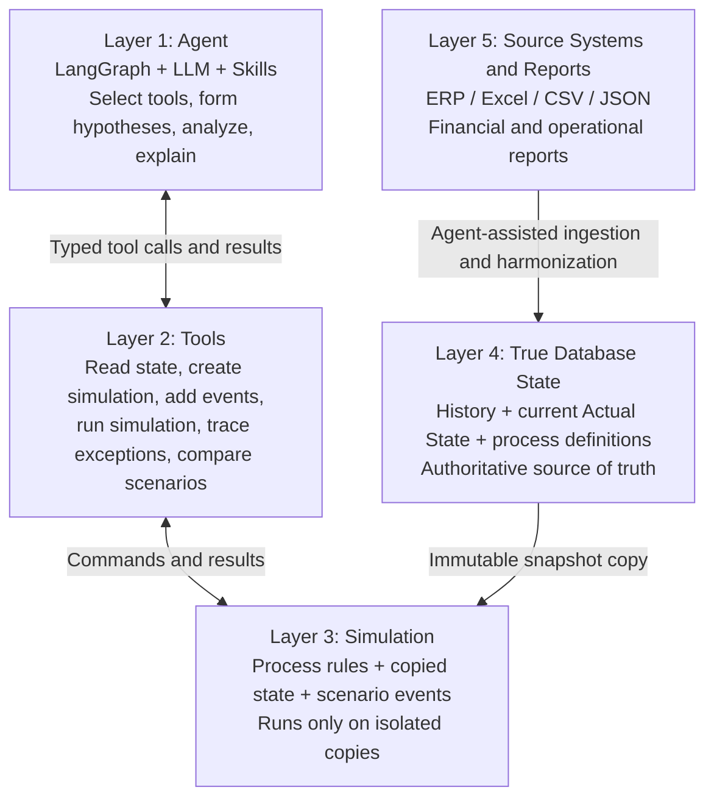

# SME Business State Coordinator

## Project Specification

**Repository:** `Show-me-your-agent-Token-Tricksters`  
**Document version:** 1.0  
**Status:** Implementation baseline  
**Target:** Three-week hackathon MVP  
**Primary language:** English

This specification is the source of truth for coding agents implementing the project. Where earlier notes or proposals conflict with this document, this document takes precedence unless a later approved specification explicitly supersedes it.

---

## 1. Product Summary

The project is an AI-assisted business coordinator for a simplified small or medium-sized enterprise (SME).

The system builds a structured representation of the enterprise's actual state from structured source-system exports and management reports. It then creates isolated simulation copies of that state. An AI Agent can inspect a simulation, add hypothetical events or parameter changes through controlled tools, run deterministic simulations, compare scenarios, investigate exceptions, and explain the expected operational and financial effects.

The Agent must never directly modify the authoritative business state.

### One-sentence definition

> An auditable AI business coordinator that converts fragmented structured SME data into a unified business state and tests operational decisions safely in an isolated enterprise simulation.

---

## 2. Goals

The MVP must demonstrate the following end-to-end loop:

```text
Structured source data
→ harmonized actual business state
→ immutable state snapshot
→ isolated simulation session
→ exception investigation
→ scenario creation
→ deterministic simulation
→ operational and financial comparison
→ Agent explanation
```

### Required goals

1. Import structured data from multiple systems or reports.
2. Normalize the data into a consistent enterprise data model.
3. Preserve source lineage and validation results.
4. Materialize the current actual business state.
5. Create immutable snapshots of that state.
6. Create isolated simulation sessions from snapshots.
7. Allow the Agent to interact with simulations only through registered tools.
8. Support deterministic event injection and scenario comparison.
9. Calculate operational and financial effects using code, not LLM arithmetic.
10. Preserve an audit trail of source data, tool calls, assumptions, runs, and conclusions.

---

## 3. Non-goals

The MVP will not:

- reproduce a complete ERP, CRM, WMS, POS, or accounting platform;
- model every function of a real enterprise;
- allow the LLM to directly update authoritative business records;
- allow the LLM to invent authoritative numeric results;
- implement autonomous execution of bank payments, borrowing, purchasing, pricing, or staffing decisions;
- provide legally compliant statutory financial statements;
- build a general-purpose BPMN platform;
- train a new machine-learning model;
- require multiple autonomous Agents;
- attempt highly accurate long-term business forecasting.

---

## 4. Core Architectural Invariants

The following rules are mandatory.

1. **Actual State is authoritative.** The True Database State is the source of truth for historical and current facts.
2. **Simulation State is isolated.** Every simulation begins from an immutable snapshot and has its own events and parameters.
3. **No reverse write from simulation to Actual State.** Simulated events and results must never update actual tables.
4. **Agent access is tool-mediated.** The Agent may read or manipulate simulations only through typed tools.
5. **Numbers are calculated deterministically.** KPIs, balances, queue metrics, and accounting effects are produced by application code.
6. **The LLM explains; it does not calculate authoritative results.** Every numeric conclusion must reference a tool result or stored run.
7. **Every result is reproducible.** A run is identified by its base snapshot, scenario events, parameters, simulation horizon, code version, and random seed.
8. **Every record is traceable.** Normalized records retain their source system, source record ID, ingestion run, and business timestamp.
9. **Actual and simulated values are visibly distinguished.** API responses and UI components must label values as `actual` or `simulated`.

---

## 5. Five-layer Architecture



### 5.1 Layer 1: Agent

Responsibilities:

- understand the user's question;
- select an approved skill;
- call registered tools;
- inspect operational exceptions;
- distinguish facts from hypotheses;
- create a limited set of scenario assumptions;
- compare stored simulation results;
- explain recommendations, evidence, assumptions, and limitations.

The Agent must not contain simulation formulas or accounting logic.

### 5.2 Layer 2: Tools

Tools are the only interface between the Agent and deterministic services. Each tool must:

- perform one bounded function;
- use Pydantic-validated inputs and outputs;
- return identifiers for all created objects;
- return structured errors;
- write an audit record;
- avoid hidden state changes.

### 5.3 Layer 3: Simulation

The Simulation Layer:

- loads an immutable actual-state snapshot;
- reconstructs the required process and resource state;
- applies scenario-specific events and parameter overrides;
- advances simulated time;
- calculates queues, capacity, inventory, cash, receivables, payables, revenue, and cost effects;
- stores results without changing Actual State.

### 5.4 Layer 4: True Database State

This layer stores:

- normalized business entities;
- historical business events;
- materialized current state;
- process definitions;
- immutable state snapshots;
- source lineage and data-quality results;
- simulation metadata and results;
- Agent and tool audit records.

### 5.5 Layer 5: Source Systems and Reports

The MVP accepts structured exports rather than relying on unstructured document extraction. Supported input formats are CSV, XLSX, and JSON.

Example sources:

- sales order export;
- purchase order export;
- inventory report;
- customer and supplier master data;
- accounts receivable and accounts payable reports;
- bank or cash-position report;
- operational capacity report.

---

## 6. MVP Enterprise Model

The demo company is a simplified Singapore-based SME distributor.

### Fixed MVP assumptions

- one legal entity;
- one functional currency: SGD;
- one warehouse;
- one sales team;
- one warehouse fulfilment team;
- one finance team;
- a limited customer and supplier master;
- 20–100 SKUs;
- no intercompany transactions;
- no foreign-currency remeasurement;
- no manufacturing or bill of materials;
- no payroll simulation;
- no tax-compliance engine.

### In-scope processes

#### Order-to-Cash

```text
Receive Order
→ Review Credit
→ Approve Order
→ Allocate Inventory
→ Pick and Pack
→ Ship Goods
→ Record Customer Invoice
→ Collect Customer Payment
```

#### Procure-to-Pay

```text
Evaluate Reorder
→ Place Purchase Order
→ Wait for Supplier Delivery
→ Receive Goods
→ Record Supplier Invoice
→ Pay Supplier
```

These two processes are sufficient to demonstrate shared inventory, resource constraints, revenue, cost, receivables, payables, and cash effects.

---

## 7. Process and State Model

Process definitions must be configuration-driven YAML files stored under `config/processes/`.

### Activity, event, and object semantics

- An **activity** is an executable flowchart step: its typed inputs, enabling
  conditions, operation, outputs, duration, resource, and next activity.
- An **object** is a current state projection such as a sales order, purchase
  order, inventory position, or account balance.
- An **event** is append-only evidence that an activity reached a state. The
  event triggers the activity's declared object and financial state changes.
- Objects, events, and activity executions use the same addressable
  `EnterpriseState.records` interface, distinguished by `record_kind`. They do
  not share the same lifecycle: object projections are updated, event records
  are appended, and activity runs progress from waiting to running to completed.

Each schema-v2 process definition must include:

- process ID, version, primary object type, and active statuses;
- initial, terminal, and cycle-completion activities;
- activity IDs, labels, and object input bindings;
- optional enabling and transition conditions;
- resource and duration rules;
- state operations generated by activity completion;
- append-only events generated on activity start or completion;
- operational metrics affected;
- financial effect mapping, if applicable.

Example:

```yaml
schema_version: 2
process_id: order_to_cash
version: 2
primary_object_type: sales_order
active_statuses: [open, backlog]
initial_activity_id: receive_order
terminal_activity_ids: [collect_customer_payment]
activities:
  - id: receive_order
    kind: activity
    inputs:
      - {alias: subject, object_type: sales_order, source: subject}
    resource: sales_staff
    duration: {kind: fixed, hours: 0.5}
    operations:
      - {operation: set, target: subject.status, value: open}
    on_complete: {event_type: order_received, references: [subject]}
    next: [{target: review_credit}]
```

Python implements a fixed vocabulary of generic primitives (`bind`, `wait`,
`request resource`, `test condition`, `set/increase/decrease`, `append event`,
`post balanced financial effect`, and `transition`). It must not hard-code an
Order-to-Cash or Procure-to-Pay workflow function.

### Enterprise State

`EnterpriseState` is a versioned dictionary of `StateRecord` values scoped by
company/project and simulation snapshot. Each record includes:

- stable `record_id`;
- `record_kind`: `object`, `event`, or `activity_run`;
- `record_type` such as `sales_order`, `inventory_position`, or
  `customer_invoiced`;
- dictionary-like `data` for business fields;
- references to related state records;
- record version, state version, and `state_type`.

This structure is designed for reuse by SimPy, the frontend, audit views, and
future Agent tools. Agent tools must query/select relevant records rather than
placing the complete Enterprise State into an LLM prompt.

### Business object source fields

Each business object must have:

- `object_id`;
- `object_type`;
- `process_id`;
- `current_activity_id` (adapted from legacy `current_node_id` snapshots);
- `status`;
- `entered_node_at`;
- `amount`;
- `quantity`;
- `priority`;
- `source_record_id`;
- `state_type`: `actual` or `simulated`.

### Aggregate activity state

For each process activity and timestamp, calculate:

- object count;
- total quantity;
- total monetary value;
- backlog count;
- average waiting time;
- available capacity;
- resource utilization;
- exception count.

---

## 8. Data Ingestion and Harmonization

### 8.1 Required ingestion flow

```text
Upload structured file
→ identify source type
→ parse rows deterministically
→ propose or load field mapping
→ validate types and business rules
→ resolve entity identifiers
→ produce preview and quality report
→ approve ingestion
→ append actual business events
→ refresh materialized state
→ create optional snapshot
```

### 8.2 Agent role in ingestion

The Agent may:

- identify the likely report type;
- choose an existing mapping template;
- propose mappings for unfamiliar column names;
- explain validation failures;
- suggest entity matches;
- request human review for ambiguous rows.

The Agent may not silently ingest low-confidence mappings. Final writes must pass deterministic validation.

### 8.3 Data lineage fields

Every imported record must retain:

- `source_system`;
- `source_file_id`;
- `source_record_id`;
- `ingestion_run_id`;
- `business_timestamp`;
- `ingested_at`;
- `mapping_version`;
- `validation_status`;
- `data_origin`: `source`, `derived`, or `synthetic`.

---

## 9. Data Model

SQLite is the default local database. SQLAlchemy models must remain compatible with PostgreSQL.

### Required tables

| Table | Purpose |
|---|---|
| `source_files` | Uploaded file metadata and hashes |
| `ingestion_runs` | Mapping, validation, and ingestion status |
| `customers` | Normalized customer master |
| `suppliers` | Normalized supplier master |
| `items` | Normalized SKU master |
| `resources` | Staff or capacity pools used by processes |
| `business_events` | Append-only actual event log |
| `business_objects` | Materialized current object state |
| `node_state_metrics` | Materialized process-node metrics |
| `state_snapshots` | Immutable actual-state snapshots |
| `snapshot_records` | Serialized records belonging to a snapshot |
| `simulation_sessions` | Persistent scenario containers |
| `simulation_events` | Scenario-only injected events and overrides |
| `simulation_runs` | Reproducible execution metadata |
| `simulation_results` | Run-level and time-series output metrics |
| `accounting_impacts` | Deterministically calculated accounting effects |
| `agent_cases` | Agent investigation state and conclusion |
| `tool_call_audit` | Tool name, input hash, result reference, and status |

### Required identifiers

Use UUIDs internally. Preserve human-readable business IDs separately.

Important relationships:

```text
source_file_id → ingestion_run_id → business_event_id
business_event_id → business_object_id
state_snapshot_id → simulation_session_id
simulation_session_id → simulation_event_id
simulation_session_id → simulation_run_id
simulation_run_id → simulation_result_id
agent_case_id → tool_call_id → simulation_run_id
```

### Snapshot requirements

A snapshot must be immutable and contain:

- `snapshot_id`;
- `company_id`;
- `as_of_time`;
- `created_at`;
- `source_event_watermark`;
- `process_definition_versions`;
- `content_hash`;
- serialized business objects, balances, resources, and pending obligations.

---

## 10. Simulation Semantics

### 10.1 Execution model

The simulation is persistent at the session level but restartable at the process level.

For each run:

1. Load the base snapshot.
2. Load session events and parameter overrides.
3. Rebuild a temporary SimPy environment.
4. Interpret the validated YAML against an isolated Enterprise State.
5. Advance to the requested horizon one simulated day at a time and publish an
   incremental checkpoint after each day.
6. Persist results, traces, and metrics.
7. Dispose of the in-memory SimPy environment.

Do not attempt to serialize SimPy generator objects.

Each checkpoint contains its simulated day/hour, state version, changed
records, new event record IDs, waiting/running activities, and deterministic
state hash. A completed 30-day run therefore returns checkpoint 0 followed by
checkpoints 1 through 30. A later API may stream these checkpoints through SSE
or WebSocket; transport timing must not change deterministic simulation output.

### 10.2 Reproducibility

Each run must persist:

- `simulation_run_id`;
- `simulation_session_id`;
- base snapshot hash;
- process-definition version;
- assumptions and event hashes;
- simulation start and end time;
- random seed;
- application commit SHA, when available;
- result hash;
- run status and error details.

Running the same snapshot, events, configuration, horizon, and seed must produce the same result.

### 10.3 Supported scenario events

The MVP must support at least:

- `order_arrival`;
- `customer_payment_received`;
- `supplier_delivery_delayed`;
- `inventory_adjustment`;
- `resource_capacity_changed`;
- `processing_time_changed`;
- `customer_payment_delay_changed`;
- `supplier_payment_terms_changed`.

### 10.4 Required simulation outputs

- ending order backlog;
- average order waiting time;
- fulfilment rate;
- resource utilization by node;
- stockout count;
- ending inventory quantity and value;
- revenue;
- cost of goods sold;
- gross profit;
- accounts receivable;
- accounts payable;
- ending cash;
- minimum cash during the horizon;
- event trace and major exceptions.

---

## 11. Tool Contracts

Tool names and schemas are public contracts. Implement tools as thin wrappers around services; do not place business rules in LangGraph nodes.

### 11.1 Actual-state and ingestion tools

#### `inspect_source_file`

Purpose: inspect a structured file and return its probable source type, columns, sample values, and validation warnings.

#### `propose_field_mapping`

Purpose: propose a source-to-canonical mapping. The result is a proposal and must not write Actual State.

#### `validate_ingestion`

Purpose: execute deterministic schema and business-rule validation.

#### `commit_ingestion`

Purpose: append validated events to Actual State. This tool requires explicit approval and must be idempotent.

#### `get_actual_state_summary`

Purpose: return a bounded, deterministic summary of current Actual State.

#### `create_state_snapshot`

Purpose: create an immutable snapshot from the latest committed Actual State.

### 11.2 Simulation tools

#### `create_simulation_session`

Input:

```json
{
  "base_snapshot_id": "uuid",
  "name": "Baseline",
  "description": "Baseline simulation from current state"
}
```

Output:

```json
{
  "simulation_session_id": "uuid",
  "base_snapshot_id": "uuid",
  "state_type": "simulated"
}
```

#### `get_simulation_state`

Purpose: return the current configured state, assumptions, events, and latest run for a simulation session.

#### `add_simulation_event`

Purpose: add a scenario event to a simulation session. It must never create an Actual State event.

#### `fork_simulation_session`

Purpose: create an independent scenario branch from an existing session.

#### `run_simulation`

Input:

```json
{
  "simulation_session_id": "uuid",
  "horizon_days": 30,
  "random_seed": 42
}
```

Output:

```json
{
  "simulation_run_id": "uuid",
  "status": "completed",
  "result_summary": {
    "ending_backlog": 12,
    "average_waiting_hours": 6.4,
    "ending_cash": 91000.0,
    "gross_profit": 42000.0
  }
}
```

#### `compare_simulation_runs`

Purpose: compare two or more stored runs using deterministic differences and percentages.

### 11.3 Diagnostic tools

#### `list_exceptions`

Returns threshold breaches and material operational or financial exceptions.

#### `trace_process_bottleneck`

Returns affected nodes, queue growth, capacity, utilization, and upstream/downstream evidence.

#### `trace_business_object`

Returns the complete event and node history for an order, purchase order, invoice, or payment.

#### `get_metric_history`

Returns an exact time series for a defined metric and period.

### 11.4 Accounting tools

#### `preview_accounting_impact`

Returns deterministic journal-impact lines associated with a stored simulation run or event.

#### `export_erpnext_payload`

Converts validated canonical events into ERPNext-compatible business-document payloads. It does not submit them by default.

---

## 12. Agent Design

Use one Coordinator Agent implemented with LangGraph. Do not implement a multi-Agent architecture for the MVP.

### 12.1 Agent state

```python
class CoordinatorState(TypedDict):
    agent_case_id: str
    user_request: str
    active_snapshot_id: str | None
    active_simulation_session_ids: list[str]
    confirmed_facts: list[dict]
    hypotheses: list[dict]
    simulation_run_ids: list[str]
    pending_approval: dict | None
    final_response: str | None
```

LangGraph persistence stores Agent workflow state. It must not replace the enterprise database.

### 12.2 Agent workflow

```text
Receive question
→ classify request
→ select skill
→ retrieve bounded state
→ identify exception or decision variable
→ state confirmed facts
→ propose up to three hypotheses
→ create or fork simulations
→ inject scenario events
→ run simulations
→ compare results
→ explain recommendation and limitations
→ stop
```

The Agent is event-driven and must not run in an uncontrolled infinite loop.

### 12.3 Required skills

Implement skills as instruction files, not executable business logic.

#### Exception Analysis Skill

1. Read the relevant simulation or actual-state summary.
2. Identify the largest threshold breach.
3. Trace the affected process node and objects.
4. Separate confirmed facts from possible causes.
5. Request additional tool evidence when needed.
6. Return ranked causes with evidence references.

#### Scenario Analysis Skill

1. Establish a baseline run.
2. Define no more than three explicit assumptions.
3. Fork one session per alternative.
4. Inject events or parameter overrides.
5. Run each alternative using the same horizon and seed.
6. Compare operational and financial outputs.
7. Explain trade-offs and limitations.

#### Data Harmonization Skill

1. Inspect the source file.
2. Select or propose a mapping.
3. Run deterministic validation.
4. Report rejected and ambiguous rows.
5. Request approval before committing Actual State.

### 12.4 Agent response requirements

Every analytical response must contain:

- the question interpreted by the Agent;
- confirmed facts;
- assumptions;
- baseline run ID;
- scenario run IDs;
- operational effects;
- financial effects;
- recommended option;
- risks and limitations.

---

## 13. Accounting and ERPNext Boundary

ERPNext is an external accounting execution adapter, not the enterprise simulation itself.

The Simulation Layer determines which economic events occur. The accounting service maps those events to financial effects. The ERPNext adapter may then create draft operational documents.

### Event mapping

| Economic event | ERPNext document | Primary effect |
|---|---|---|
| Customer order approved | Sales Order | No General Ledger entry |
| Goods shipped | Delivery Note | Inventory decrease and cost of goods sold |
| Customer billed | Sales Invoice | Receivable, revenue, and tax |
| Customer payment received | Payment Entry | Cash increase and receivable decrease |
| Purchase order placed | Purchase Order | No General Ledger entry |
| Goods received | Purchase Receipt | Inventory increase and receipt accrual |
| Supplier invoice recorded | Purchase Invoice | Payable and inventory/expense effect |
| Supplier paid | Payment Entry | Payable decrease and cash decrease |

### MVP requirement

The application must have an `AccountingAdapter` interface with:

- an in-process deterministic implementation used by tests and offline demos;
- an ERPNext payload exporter;
- optional ERPNext API submission behind an explicit configuration flag and approval step.

No simulation run may automatically submit documents to ERPNext.

---

## 14. API Requirements

Implement a FastAPI backend.

### Minimum endpoints

```text
POST   /api/v1/source-files
POST   /api/v1/ingestions/inspect
POST   /api/v1/ingestions/validate
POST   /api/v1/ingestions/{id}/commit

GET    /api/v1/state/summary
POST   /api/v1/state/snapshots
GET    /api/v1/state/snapshots/{id}

POST   /api/v1/simulations
GET    /api/v1/simulations/{id}
POST   /api/v1/simulations/{id}/events
POST   /api/v1/simulations/{id}/fork
POST   /api/v1/simulations/{id}/runs
GET    /api/v1/simulation-runs/{id}
POST   /api/v1/simulation-runs/compare

GET    /api/v1/exceptions
GET    /api/v1/business-objects/{id}/trace

POST   /api/v1/agent/cases
POST   /api/v1/agent/cases/{id}/messages
GET    /api/v1/agent/cases/{id}
```

### API rules

- Use `/api/v1` versioning.
- Use Pydantic request and response models.
- Return machine-readable error codes.
- Reject unknown event types.
- Enforce idempotency for commit and external-write endpoints.
- Include `state_type`, relevant IDs, and timestamps in responses.
- Do not return entire database tables to the LLM.

---

## 15. User Interface

Use Streamlit for the MVP unless the team explicitly approves a different frontend.

### Required views

#### Data Setup

- upload structured files;
- preview detected columns and mappings;
- display validation errors;
- approve valid ingestion;
- show the latest Actual State snapshot.

#### Business State Dashboard

- headline KPIs;
- process-node backlog and utilization;
- inventory position;
- receivables, payables, and cash;
- active exceptions;
- visible `ACTUAL` label.

#### Scenario Workspace

- choose a base snapshot;
- create baseline and alternative sessions;
- add supported events or parameter changes;
- run simulations;
- compare results in a table;
- visible `SIMULATED` label.

#### Agent Workspace

- chat input;
- Agent conclusion;
- confirmed facts and assumptions;
- tool-call trace;
- run IDs and scenario comparison;
- recommendation and limitations.

---

## 16. Technology Stack

### Required defaults

- Python 3.12;
- `uv` for environment and dependency management;
- FastAPI for APIs;
- Pydantic v2 for schemas;
- SQLAlchemy 2 and Alembic for persistence;
- SQLite locally, with PostgreSQL compatibility;
- SimPy for discrete-event simulation;
- LangGraph for Agent orchestration and checkpointing;
- pandas and openpyxl for structured file ingestion;
- Streamlit for the MVP UI;
- pytest for tests;
- Ruff for linting and formatting;
- mypy or pyright for static type checking;
- Docker for reproducible deployment.

### LLM provider boundary

Create an `LLMProvider` abstraction. The initial production adapter may use Amazon Bedrock, but model IDs, credentials, and region must be environment configuration. Tests must use a fake provider and must not require network access.

---

## 17. Repository Structure

Coding agents should implement the following structure:

```text
.
├── PROJECT_SPECIFICATION.md
├── README.md
├── pyproject.toml
├── uv.lock
├── .env.example
├── Dockerfile
├── docker-compose.yml
├── alembic.ini
├── migrations/
├── config/
│   ├── processes/
│   │   ├── order_to_cash.yaml
│   │   └── procure_to_pay.yaml
│   ├── mappings/
│   └── thresholds.yaml
├── data/
│   └── demo/
│       ├── raw/
│       └── expected/
├── src/business_coordinator/
│   ├── api/
│   ├── agent/
│   │   ├── graph.py
│   │   ├── state.py
│   │   └── skills/
│   ├── tools/
│   ├── ingestion/
│   ├── domain/
│   ├── persistence/
│   ├── simulation/
│   ├── accounting/
│   ├── erpnext/
│   └── observability/
├── ui/
│   └── streamlit_app.py
├── scripts/
│   ├── seed_demo_data.py
│   └── run_demo.py
└── tests/
    ├── unit/
    ├── integration/
    ├── simulation/
    ├── agent/
    └── fixtures/
```

---

## 18. Demo Data

Provide deterministic synthetic demo data under `data/demo/`.

### Minimum data set

- 90 days of history;
- at least 500 sales orders;
- at least 50 purchase orders;
- item and party master files;
- inventory movements and ending inventory;
- customer and supplier payments;
- resource capacity by process node;
- accounting balances sufficient to derive cash, receivables, payables, revenue, cost, and inventory.

### Required embedded exception

The demo data must contain one coherent exception:

1. order arrivals increase for selected SKUs;
2. warehouse capacity becomes constrained;
3. order backlog and waiting time increase;
4. inventory approaches stockout;
5. customer collections are delayed;
6. short-term cash pressure becomes visible.

The ground-truth cause and expected metrics must be stored in `data/demo/expected/` for automated evaluation.

---

## 19. Required Demo Scenario

The primary demo question is:

> Why is the order backlog increasing, and what happens if the company adds one warehouse worker or expedites the next supplier delivery?

### Expected Agent sequence

1. Retrieve the latest Actual State snapshot.
2. Create and run a baseline simulation.
3. Trace the bottleneck and identify confirmed evidence.
4. Fork Scenario A: add one warehouse worker.
5. Fork Scenario B: reduce supplier delivery delay.
6. Run both scenarios using the same horizon and random seed.
7. Compare backlog, fulfilment, stockouts, gross profit, receivables, payables, and cash.
8. Recommend an option with run IDs, evidence, assumptions, and limitations.

---

## 20. Testing Requirements

### Unit tests

Test:

- field mappings;
- schema validation;
- entity resolution rules;
- state transitions and guards;
- KPI formulas;
- accounting effects;
- simulation event validation;
- tool input and output schemas.

### Integration tests

Test:

- file ingestion to Actual State;
- Actual State to snapshot;
- snapshot to simulation session;
- event injection to stored run;
- run comparison;
- tool audit creation;
- Agent tool routing with a fake LLM;
- ERPNext payload generation without external submission.

### Mandatory invariant tests

1. Running a simulation does not change the Actual State hash.
2. Two runs with identical inputs and seed produce identical result hashes.
3. Forking a scenario does not change its parent session.
4. Rejected ingestion does not create business events.
5. Every displayed number can be traced to a query or simulation run.
6. Accounting debits equal credits for every generated accounting impact.
7. The Agent cannot call unregistered functions.

---

## 21. Observability and Auditability

Log the following for every tool call:

- timestamp;
- Agent case ID;
- tool name;
- validated arguments or argument hash;
- caller identity;
- created or referenced object IDs;
- duration;
- status;
- structured error code;
- result hash.

Do not log secrets or raw credentials.

Agent conclusions must reference stored tool-call and simulation-run IDs rather than unsupported chain-of-thought text.

---

## 22. Security and Approval Boundaries

- Actual State writes require validated ingestion.
- Ambiguous source mappings require human approval.
- ERPNext submission is disabled by default.
- External actions require explicit approval and idempotency keys.
- API credentials are provided only through environment variables or secret stores.
- Uploaded files must be size-limited and stored using generated IDs.
- Never execute code found inside uploaded files.
- Formula cells from XLSX files are treated as data and are not executed by the application.

---

## 23. Configuration

Provide `.env.example` with at least:

```dotenv
APP_ENV=development
DATABASE_URL=sqlite:///./business_coordinator.db
LOG_LEVEL=INFO

LLM_PROVIDER=fake
AWS_REGION=
AWS_BEDROCK_MODEL_ID=

ERPNEXT_ENABLED=false
ERPNEXT_BASE_URL=
ERPNEXT_API_KEY=
ERPNEXT_API_SECRET=
```

Do not commit real credentials.

---

## 24. Implementation Sequence

### Milestone 1: Deterministic foundation

- scaffold repository and dependency management;
- implement domain schemas and database models;
- define Order-to-Cash and Procure-to-Pay YAML files;
- implement ingestion, validation, event log, materialized state, and snapshots;
- seed deterministic demo data;
- implement unit tests.

### Milestone 2: Simulation and tools

- implement snapshot loader;
- implement SimPy processes and resources;
- implement supported scenario events;
- implement operational and financial metrics;
- implement simulation sessions, forks, runs, and comparisons;
- expose typed tools and FastAPI endpoints;
- add invariant and integration tests.

### Milestone 3: Agent and demo

- implement LangGraph Coordinator;
- add the three required skills;
- add fake and configured production LLM providers;
- implement Streamlit views;
- add tool and run audit display;
- implement ERPNext payload export;
- rehearse the required demo scenario;
- finalize README and deployment instructions.

---

## 25. Acceptance Criteria

The MVP is accepted only when all of the following are demonstrable:

1. A user can upload at least four structured source files with different schemas.
2. The system shows a proposed mapping, validation result, and source lineage.
3. Approved data forms a normalized Actual State.
4. The system creates an immutable snapshot with a reproducible content hash.
5. A simulation session is created from that snapshot.
6. The user or Agent can add a supported event to the simulation only.
7. The baseline and at least two alternative scenarios run successfully.
8. Identical inputs and seeds reproduce identical outputs.
9. Simulation does not change Actual State.
10. Operational and financial results are compared deterministically.
11. The Agent identifies the demo exception and calls the expected tools.
12. The final Agent answer cites facts, assumptions, and run IDs.
13. Tool calls and scenario changes are visible in an audit log.
14. All mandatory invariant tests pass.
15. The complete demo can run locally from documented commands without manually editing source code.

---

## 26. Definition of Done for Coding Agents

A coding task is complete only when:

- implementation matches this specification;
- public schemas and tool contracts are typed;
- relevant tests have been added and pass;
- lint and type checks pass;
- no secrets or local absolute paths are committed;
- README instructions are updated when commands or configuration change;
- Actual State and Simulation State remain clearly separated;
- error handling is explicit;
- the implementation is reviewed for idempotency and auditability.
